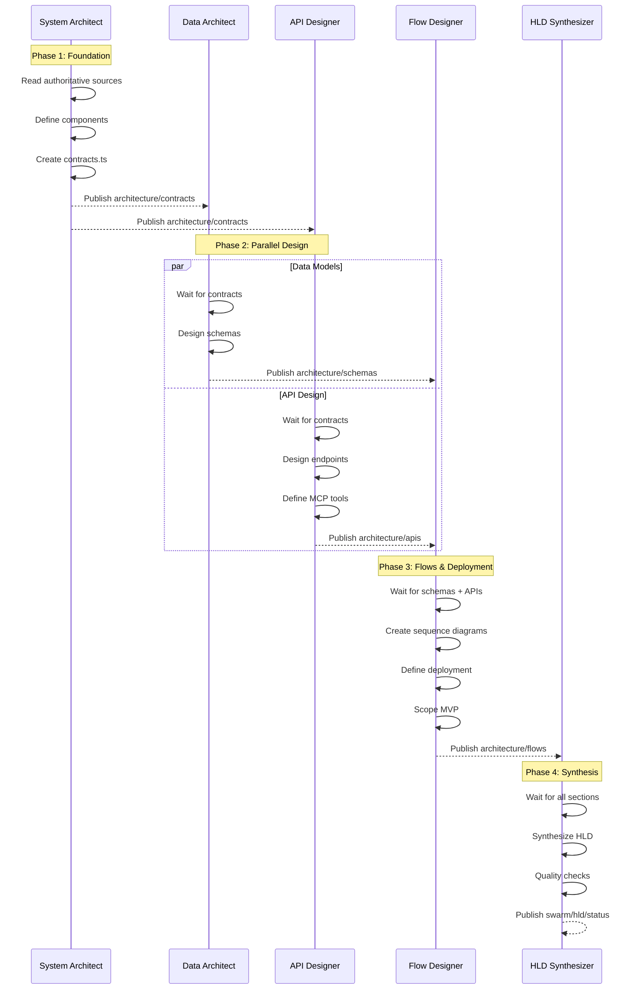

# HLD Swarm Design: TV5 Media Gateway

> **Purpose:** Define the swarm configuration to produce the High-Level Design (HLD) for TV5 Media Gateway's edge-first architecture.

---

## Pre-Work Assessment

### What Are We Building?

**Objective:** Produce a complete High-Level Design document covering:
1. System components with interfaces
2. Data models (concrete TypeScript schemas)
3. API contracts (OpenAPI + MCP tool definitions)
4. Sequence diagrams (key user flows)
5. Deployment architecture (three-tier edge)
6. Hackathon MVP scope (what ships in 3 days)

### SPARC Phase

This is primarily **Architecture** phase with elements of **Specification** refinement.

| SPARC Phase | Application |
|-------------|-------------|
| Specification | Refine from executive-summary.md and edge-user-activity-architecture.md |
| Architecture | **PRIMARY** - Define components, interfaces, contracts |
| Pseudocode | Included in sequence diagrams |

### Task Complexity Assessment

```
Multi-component feature (2-4 hours estimated)
├── 6 distinct deliverables
├── Multiple specialized perspectives needed
├── Sequential dependencies (components → schemas → APIs)
└── Decision: Swarm (5 agents)
```

### Topology Selection

```
How do agents need to coordinate?
├── System Architect defines components FIRST
│   └── Other agents depend on component boundaries
├── Data + API can work in parallel (shared contracts)
├── Sequence diagrams depend on API definitions
└── Decision: Hierarchical with parallel middle tier

    System Architect (coordinator)
           │
    ┌──────┴──────┐
    ↓             ↓
Data Architect  API Designer  (parallel, shared contracts)
    │             │
    └──────┬──────┘
           ↓
    Flow Designer (sequences + deployment + MVP scope)
```

---

## Swarm Configuration

### Swarm Metadata

```yaml
swarm_id: hld-tv5-media-gateway
topology: hierarchical
max_agents: 5
strategy: specialized
objective: "Produce complete HLD for TV5 edge-first media gateway"
```

### Quality Gates (MANDATORY)

All agents must verify:
- [ ] TypeScript schemas compile: `tsc --noEmit`
- [ ] OpenAPI validates: `npx @redocly/cli lint`
- [ ] Mermaid diagrams render correctly
- [ ] No placeholder TODOs in final output
- [ ] References authoritative source: `edge-user-activity-architecture.md`

### Success Criteria

- [ ] Component diagram with clear boundaries
- [ ] TypeScript interfaces for all data models
- [ ] OpenAPI 3.1 spec for REST endpoints
- [ ] MCP tool definitions for agent interactions
- [ ] Sequence diagrams for 5 key user flows
- [ ] Deployment diagram (Tier 0/1/2)
- [ ] MVP scope checklist (Day 1/2/3 breakdown)

---

## Agent Definitions

### Agent 1: System Architect (Coordinator)

**Type:** `system-architect`
**Role:** Define component boundaries, interfaces, module ownership
**Runs:** FIRST (others wait for contracts)

**Tasks:**
1. Read authoritative sources:
   - `/workspaces/tv5-fork/docs/research/edge-user-activity-architecture.md`
   - `/workspaces/tv5-fork/docs/research/executive-summary.md`
   - `/workspaces/tv5-fork/docs/research/architecture-final.md`

2. Define system components:
   - Tier 0: Device components (RuVector, ActivityCollector, ProfileStore)
   - Tier 1: Edge components (Workers, Vectorize, KV)
   - Tier 2: Central components (AgentDB, PostgreSQL, OntologyEngine)

3. Create TypeScript contracts file with interfaces

4. Publish to memory for other agents

**Publishes:**
```bash
npx claude-flow@alpha memory store \
  --namespace "architecture/contracts" \
  --key "modules" \
  --value '{
    "canonical_types_file": "docs/hld/contracts.ts",
    "components": {
      "tier0": ["RuVectorWASM", "ActivityCollector", "ProfileStore", "OfflineCache"],
      "tier1": ["EdgeWorker", "VectorizeIndex", "AvailabilityCache", "ActivityAggregator"],
      "tier2": ["AgentDB", "MetadataStore", "OntologyEngine", "AgentSwarm"]
    }
  }'
```

**Dependencies:** None (runs first)

**Deliverable:** `/docs/hld/01-system-components.md` + `/docs/hld/contracts.ts`

---

### Agent 2: Data Architect

**Type:** `code-analyzer`
**Role:** Design data models, schemas, storage patterns
**Runs:** After System Architect publishes contracts

**Tasks:**
1. Wait for contracts:
   ```bash
   while ! npx claude-flow@alpha memory read \
     --namespace "architecture/contracts" \
     --key "modules"; do sleep 5; done
   ```

2. Design data models:
   - ActivityEvent schema (6 signal types)
   - UserProfile schema (preferences, history, clusters)
   - MediaTitle schema (metadata, embeddings, availability)
   - SyncPayload schema (device → edge → central)

3. Define storage patterns:
   - IndexedDB schemas for Tier 0
   - Workers KV structure for Tier 1
   - PostgreSQL + AgentDB for Tier 2

**Publishes:**
```bash
npx claude-flow@alpha memory store \
  --namespace "architecture/schemas" \
  --key "data-models" \
  --value "Complete - see /docs/hld/02-data-models.md"
```

**Dependencies:** `architecture/contracts/modules`

**Deliverable:** `/docs/hld/02-data-models.md`

---

### Agent 3: API Designer

**Type:** `api-docs`
**Role:** Define API contracts, endpoints, MCP tools
**Runs:** After System Architect publishes contracts (parallel with Data Architect)

**Tasks:**
1. Wait for contracts (same as Data Architect)

2. Design REST APIs:
   - `/api/search` - Semantic search endpoint
   - `/api/activity` - Activity sync endpoint
   - `/api/profile` - User profile endpoint
   - `/api/availability` - Streaming availability endpoint

3. Design MCP tools for agent interactions:
   - `search_catalog` - Semantic search tool
   - `get_availability` - Platform availability tool
   - `update_profile` - Profile update tool
   - `sync_activity` - Activity sync tool

4. Create OpenAPI 3.1 specification

**Publishes:**
```bash
npx claude-flow@alpha memory store \
  --namespace "architecture/apis" \
  --key "contracts" \
  --value "Complete - see /docs/hld/03-api-contracts.md"
```

**Dependencies:** `architecture/contracts/modules`

**Deliverable:** `/docs/hld/03-api-contracts.md` + `/docs/hld/openapi.yaml`

---

### Agent 4: Flow Designer

**Type:** `researcher`
**Role:** Create sequence diagrams, deployment architecture, MVP scope
**Runs:** After Data Architect AND API Designer complete

**Tasks:**
1. Wait for schemas and APIs:
   ```bash
   while ! npx claude-flow@alpha memory read \
     --namespace "architecture/schemas" \
     --key "data-models"; do sleep 5; done

   while ! npx claude-flow@alpha memory read \
     --namespace "architecture/apis" \
     --key "contracts"; do sleep 5; done
   ```

2. Create sequence diagrams (Mermaid):
   - User Search Flow (device → edge → central fallback)
   - Activity Collection Flow (event → batch → sync)
   - Profile Update Flow (local → edge aggregation)
   - Availability Check Flow (cache → JustWatch)
   - Offline Mode Flow (device-only operation)

3. Create deployment diagram:
   - Tier 0: User device (browser/app)
   - Tier 1: Cloudflare (330+ PoPs)
   - Tier 2: Central cloud (single region)

4. Define MVP scope:
   - Day 1: Edge foundation (WASM, IndexedDB, basic search)
   - Day 2: Intelligence layer (activity, ontology, profiles)
   - Day 3: Demo polish (visualization, offline, privacy dashboard)

**Publishes:**
```bash
npx claude-flow@alpha memory store \
  --namespace "architecture/flows" \
  --key "sequences" \
  --value "Complete - see /docs/hld/04-sequence-diagrams.md"
```

**Dependencies:** `architecture/schemas/data-models`, `architecture/apis/contracts`

**Deliverable:** `/docs/hld/04-sequence-diagrams.md` + `/docs/hld/05-deployment.md` + `/docs/hld/06-mvp-scope.md`

---

### Agent 5: HLD Synthesizer

**Type:** `reviewer`
**Role:** Synthesize all outputs into unified HLD document
**Runs:** LAST (after all other agents complete)

**Tasks:**
1. Wait for all deliverables:
   ```bash
   while ! npx claude-flow@alpha memory read \
     --namespace "architecture/flows" \
     --key "sequences"; do sleep 5; done
   ```

2. Read all HLD section documents

3. Create unified HLD document with:
   - Executive summary
   - Table of contents
   - All sections integrated
   - Cross-references validated
   - Glossary of terms

4. Verify quality gates:
   - All TypeScript compiles
   - All diagrams render
   - No TODOs remaining
   - References edge-user-activity-architecture.md

**Publishes:**
```bash
npx claude-flow@alpha memory store \
  --namespace "swarm/hld" \
  --key "status" \
  --value '{"phase": "complete", "deliverable": "/docs/hld/HLD-COMPLETE.md"}'
```

**Dependencies:** All previous agents

**Deliverable:** `/docs/hld/HLD-COMPLETE.md`

---

## Memory Schema

| Namespace | Published By | Contains |
|-----------|--------------|----------|
| `architecture/contracts` | System Architect | Module boundaries, interface definitions |
| `architecture/schemas` | Data Architect | Data model completion status |
| `architecture/apis` | API Designer | API contract completion status |
| `architecture/flows` | Flow Designer | Sequence diagram completion status |
| `swarm/hld` | HLD Synthesizer | Final swarm status |

---

## Spawn Command

**CRITICAL:** All agents MUST be spawned in a SINGLE message.

```javascript
// Spawn in ONE message for proper coordination
[
  Task('System Architect',
    `You are the System Architect for TV5 Media Gateway HLD.

    🎯 YOUR JOB: Define system components, boundaries, and TypeScript interfaces.

    AUTHORITATIVE SOURCES (READ FIRST):
    - /workspaces/tv5-fork/docs/research/edge-user-activity-architecture.md
    - /workspaces/tv5-fork/docs/research/executive-summary.md
    - /workspaces/tv5-fork/docs/research/architecture-final.md

    ARCHITECTURE CONTEXT:
    - Three-tier: Tier 0 (Device) → Tier 1 (Cloudflare) → Tier 2 (Central)
    - Edge-first: RuVector WASM at 61µs, user activity monitoring
    - Privacy-first: Data stays on device, GDPR/CCPA compliant
    - jjohare collaboration: GMC-O ontology (18KB full, 3KB edge)

    DELIVERABLES:
    1. /docs/hld/01-system-components.md - Component diagram and descriptions
    2. /docs/hld/contracts.ts - TypeScript interfaces for all components

    COMPONENTS TO DEFINE:
    Tier 0 (Device):
    - RuVectorWASM: Vector search engine
    - ActivityCollector: 6 signal types
    - ProfileStore: IndexedDB user profiles
    - OfflineCache: Offline-capable cache

    Tier 1 (Cloudflare Edge):
    - EdgeWorker: Request routing, search
    - VectorizeIndex: 100K regional titles
    - AvailabilityCache: Workers KV
    - ActivityAggregator: Anonymized sync

    Tier 2 (Central):
    - AgentDB: 400K+ vectors
    - MetadataStore: PostgreSQL
    - OntologyEngine: GMC-O reasoning
    - AgentSwarm: CatalogScout, Enricher, ProfileBuilder, Analytics, OntologyReasoner

    WHEN DONE:
    npx claude-flow@alpha memory store \\
      --namespace "architecture/contracts" \\
      --key "modules" \\
      --value '{"status": "complete", "file": "/docs/hld/contracts.ts"}'
    npx claude-flow@alpha hooks post-task --task-id "system-architect"
    `,
    'system-architect'
  ),

  Task('Data Architect',
    `You are the Data Architect for TV5 Media Gateway HLD.

    🎯 YOUR JOB: Design data models, schemas, storage patterns.

    WAIT FOR CONTRACTS FIRST:
    while ! npx claude-flow@alpha memory read \\
      --namespace "architecture/contracts" \\
      --key "modules" | grep -q "complete"; do sleep 5; done

    THEN READ:
    - /docs/hld/contracts.ts (from System Architect)
    - /workspaces/tv5-fork/docs/research/edge-user-activity-architecture.md

    DELIVERABLE: /docs/hld/02-data-models.md

    SCHEMAS TO DEFINE (TypeScript):
    1. ActivityEvent - 6 signal types:
       - SearchEvent: query, filters, results, clicks
       - LingerEvent: titleId, duration, scrollDepth
       - TrailerEvent: titleId, watchDuration, soundOn, replays
       - BrowseEvent: category, dwellTime, navigation
       - WatchEvent: titleId, startTime, endTime, completionPct
       - SkipEvent: titleId, skipTime, reason

    2. UserProfile:
       - deviceId (hashed), preferences, watchHistory
       - tasteClusters, psychographicState, tolerances

    3. MediaTitle:
       - tmdbId, wikidataQID, title, metadata
       - embedding (384-dim), availability

    4. SyncPayload:
       - Anonymization transform (device → edge)
       - Aggregation transform (edge → central)

    STORAGE PATTERNS:
    - Tier 0: IndexedDB schemas
    - Tier 1: Workers KV structure
    - Tier 2: PostgreSQL + AgentDB

    WHEN DONE:
    npx claude-flow@alpha memory store \\
      --namespace "architecture/schemas" \\
      --key "data-models" \\
      --value "complete"
    npx claude-flow@alpha hooks post-task --task-id "data-architect"
    `,
    'code-analyzer'
  ),

  Task('API Designer',
    `You are the API Designer for TV5 Media Gateway HLD.

    🎯 YOUR JOB: Define REST APIs and MCP tool contracts.

    WAIT FOR CONTRACTS FIRST:
    while ! npx claude-flow@alpha memory read \\
      --namespace "architecture/contracts" \\
      --key "modules" | grep -q "complete"; do sleep 5; done

    THEN READ:
    - /docs/hld/contracts.ts (from System Architect)
    - /workspaces/tv5-fork/docs/research/edge-user-activity-architecture.md

    DELIVERABLES:
    1. /docs/hld/03-api-contracts.md - API documentation
    2. /docs/hld/openapi.yaml - OpenAPI 3.1 specification

    REST ENDPOINTS TO DEFINE:
    1. POST /api/search
       - Input: query, filters, embedding (optional)
       - Output: results[], latency, tier (device/edge/central)

    2. POST /api/activity
       - Input: events[], deviceIdHash, timestamp
       - Output: ack, syncId

    3. GET /api/profile/:deviceIdHash
       - Output: preferences, clusters, recommendations

    4. GET /api/availability/:titleId
       - Output: platforms[], deepLinks, prices

    MCP TOOLS TO DEFINE:
    1. search_catalog - For AI agents to search
    2. get_availability - Platform availability lookup
    3. update_profile - Profile updates from agents
    4. sync_activity - Activity batch sync
    5. ontology_query - GMC-O reasoning queries

    WHEN DONE:
    npx claude-flow@alpha memory store \\
      --namespace "architecture/apis" \\
      --key "contracts" \\
      --value "complete"
    npx claude-flow@alpha hooks post-task --task-id "api-designer"
    `,
    'api-docs'
  ),

  Task('Flow Designer',
    `You are the Flow Designer for TV5 Media Gateway HLD.

    🎯 YOUR JOB: Create sequence diagrams, deployment architecture, MVP scope.

    WAIT FOR SCHEMAS AND APIS:
    while ! npx claude-flow@alpha memory read \\
      --namespace "architecture/schemas" \\
      --key "data-models" | grep -q "complete"; do sleep 5; done

    while ! npx claude-flow@alpha memory read \\
      --namespace "architecture/apis" \\
      --key "contracts" | grep -q "complete"; do sleep 5; done

    THEN READ:
    - /docs/hld/02-data-models.md
    - /docs/hld/03-api-contracts.md
    - /workspaces/tv5-fork/docs/research/executive-summary.md (demo strategy)

    DELIVERABLES:
    1. /docs/hld/04-sequence-diagrams.md - Mermaid sequence diagrams
    2. /docs/hld/05-deployment.md - Deployment architecture
    3. /docs/hld/06-mvp-scope.md - Hackathon MVP breakdown

    SEQUENCE DIAGRAMS (Mermaid):
    1. User Search Flow:
       User → Device(RuVector) → [cache miss] → Edge(Vectorize) → [cache miss] → Central(AgentDB)

    2. Activity Collection Flow:
       UserAction → ActivityCollector → IndexedDB → BatchSync → EdgeAggregator → CentralAnalytics

    3. Profile Update Flow:
       Activity → ProfileBuilder → LocalProfile → [anonymized] → EdgeTrends

    4. Availability Check Flow:
       TitleSelect → AvailabilityCache → [miss] → JustWatch API → Cache

    5. Offline Mode Flow:
       UserOffline → DeviceCache → RuVectorWASM → LocalResults

    DEPLOYMENT DIAGRAM:
    - Tier 0: Browser/App (RuVector WASM, IndexedDB)
    - Tier 1: Cloudflare (330+ PoPs, Workers, Vectorize, KV)
    - Tier 2: Central (AgentDB, PostgreSQL, GMC-O)

    MVP SCOPE:
    - Day 1: Edge foundation
    - Day 2: Intelligence layer
    - Day 3: Demo polish

    WHEN DONE:
    npx claude-flow@alpha memory store \\
      --namespace "architecture/flows" \\
      --key "sequences" \\
      --value "complete"
    npx claude-flow@alpha hooks post-task --task-id "flow-designer"
    `,
    'researcher'
  ),

  Task('HLD Synthesizer',
    `You are the HLD Synthesizer for TV5 Media Gateway.

    🎯 YOUR JOB: Combine all HLD sections into unified document.

    WAIT FOR ALL SECTIONS:
    while ! npx claude-flow@alpha memory read \\
      --namespace "architecture/flows" \\
      --key "sequences" | grep -q "complete"; do sleep 5; done

    READ ALL HLD DOCUMENTS:
    - /docs/hld/01-system-components.md
    - /docs/hld/02-data-models.md
    - /docs/hld/03-api-contracts.md
    - /docs/hld/04-sequence-diagrams.md
    - /docs/hld/05-deployment.md
    - /docs/hld/06-mvp-scope.md
    - /docs/hld/contracts.ts
    - /docs/hld/openapi.yaml

    DELIVERABLE: /docs/hld/HLD-COMPLETE.md

    STRUCTURE:
    1. Executive Summary (from exec summary, focused on HLD)
    2. Table of Contents
    3. System Components (from 01)
    4. Data Models (from 02)
    5. API Contracts (from 03)
    6. Sequence Diagrams (from 04)
    7. Deployment Architecture (from 05)
    8. MVP Scope (from 06)
    9. Appendix: TypeScript Contracts
    10. Appendix: OpenAPI Specification
    11. Glossary

    QUALITY CHECKS:
    - All cross-references valid
    - All diagrams render
    - No placeholder TODOs
    - References edge-user-activity-architecture.md as authoritative

    FRONTMATTER:
    ---
    status: keep
    phase: complete
    type: design
    version: 1.0
    last-updated: 2025-12-07
    title: High-Level Design - TV5 Media Gateway
    ---

    WHEN DONE:
    npx claude-flow@alpha memory store \\
      --namespace "swarm/hld" \\
      --key "status" \\
      --value '{"phase": "complete", "deliverable": "/docs/hld/HLD-COMPLETE.md"}'
    npx claude-flow@alpha hooks post-task --task-id "hld-synthesizer"
    `,
    'reviewer'
  )
]
```

---

## Execution Flow Diagram



---

## Post-Swarm Triage

### Expected Outcomes

| Agent | Primary Deliverable | Verification |
|-------|--------------------|--------------|
| System Architect | `01-system-components.md`, `contracts.ts` | TypeScript compiles |
| Data Architect | `02-data-models.md` | Schemas valid |
| API Designer | `03-api-contracts.md`, `openapi.yaml` | OpenAPI validates |
| Flow Designer | `04-sequence-diagrams.md`, `05-deployment.md`, `06-mvp-scope.md` | Mermaid renders |
| HLD Synthesizer | `HLD-COMPLETE.md` | All cross-refs valid |

### Likely Failure Modes

| Failure | Detection | Fix |
|---------|-----------|-----|
| Type mismatches | TypeScript errors | Type Aligner fixer agent |
| Missing cross-refs | Broken links in HLD | Manual edit |
| Incomplete schemas | TODOs in output | Re-run Data Architect |
| OpenAPI validation | Redocly lint fails | API fixer agent |

### Cleanup Pattern

If CI/validation fails, use single fixer agent:

```javascript
Task('[Category] Fixer',
  `Fix these issues in HLD documents:
  [Paste validation output]

  Run verification after fixes.
  `,
  'coder'
);
```

---

## Architectural Decisions to Capture

After swarm completes, store key decisions:

```bash
# Store HLD decisions in project memory
npx claude-flow@alpha memory store \
  --namespace "architecture/decisions" \
  --key "hld-tier-boundaries" \
  --value "Tier 0 owns user data, Tier 1 owns availability, Tier 2 owns catalog. Rationale: Privacy + latency optimization."

npx claude-flow@alpha memory store \
  --namespace "architecture/decisions" \
  --key "hld-activity-schema" \
  --value "6 signal types with union discriminator. Rationale: Extensible, TypeScript-friendly, IndexedDB compatible."
```

---

## Success Validation

After swarm completes:

```bash
# Verify all files exist
ls -la /docs/hld/

# Verify TypeScript compiles
npx tsc --noEmit /docs/hld/contracts.ts

# Verify OpenAPI validates
npx @redocly/cli lint /docs/hld/openapi.yaml

# Record successful pattern
npx claude-flow@alpha memory feedback \
  --pattern "swarm/hld/config" \
  --outcome success \
  --reasoningbank
```

---

## Related Documents

| Document | Purpose |
|----------|---------|
| [workflow.md](./workflow.md) | Swarm workflow patterns |
| [swarm-templates.md](./swarm-templates.md) | Agent prompt templates |
| [edge-user-activity-architecture.md](/workspaces/tv5-fork/docs/research/edge-user-activity-architecture.md) | Authoritative architecture source |
| [executive-summary.md](/workspaces/tv5-fork/docs/research/executive-summary.md) | Strategic context |

---

**Estimated Duration:** 2-3 hours (parallel execution)
**Agent Count:** 5
**Topology:** Hierarchical with parallel middle tier
**Output:** `/docs/hld/HLD-COMPLETE.md` + supporting files
